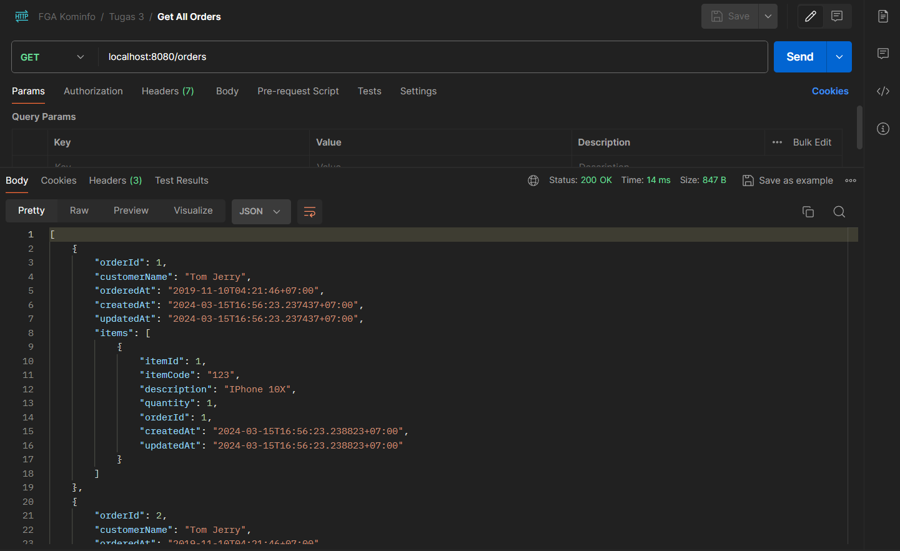
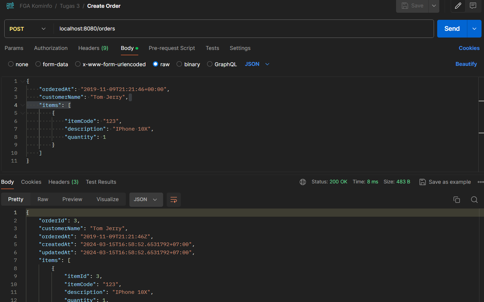
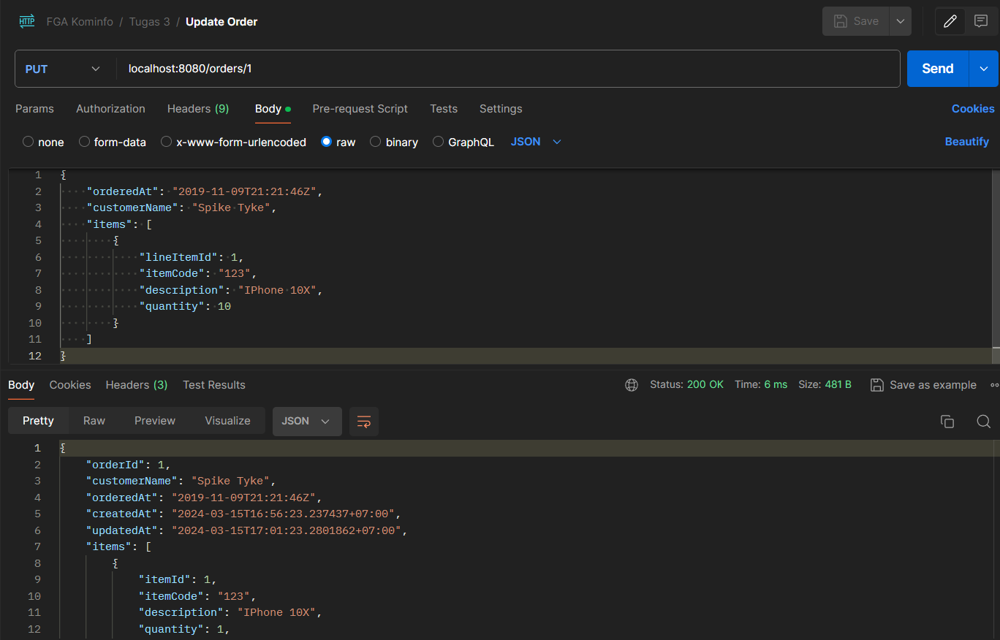

# Buat orders dan product API

[Link Soal](https://www.kode.id/courses/take/scalable-web-service-with-golang-kominfo/pdfs/38528096-assignment-2 )

## Soal :
Build Rest API In GO

Buatkan endpoint-endpoint untuk :
1. Path : `/orders` Method: POST

Request Body
```
{
    "orderedAt": "2019-11-09T21:21:46+00:00",
    "customerName": "Tom Jerry",
    "items": [
        {
            "itemCode": "123",
            "description": "IPhone 10X",
            "quantity": 1
        }
    ]
}
```
2. Path `/orders` Method: GET

3. Path `/orders/:orderId` Method: PUT 

Request Body 
```
{
    "orderedAt": "2019-11-09T21:21:46Z",
    "customerName": "Spike Tyke",
    "items": [
        {
            "lineItemId": 1,
            "itemCode": "123",
            "description": "IPhone 10X",
            "quantity": 10
        }
    ]
}
```
4. Path `/orders/:orderId` Method: DELETE


## Dokumentasi Postman
GET Request


POST Request


PUT Request


DELETE Request

